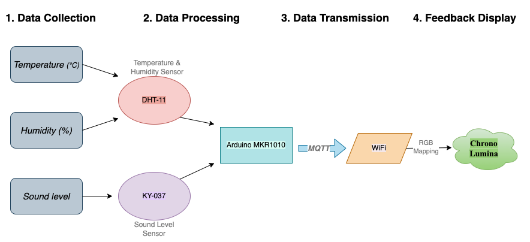

# CASA0014 - Chrono Lumina Prototype🌟

This repository contains the Arduino-based prototype developed for the CASA0014 Connected Environments module at UCL. The project visualizes real-time environmental data using a Chrono Lumina lighting system, showcasing how IoT devices can reflect changes in the environment through dynamic RGB lighting.

✨✨✨

## Project Overview

The Chrono Lumina Prototype is designed to:
- Collect data from the environment (temperature, humidity, and sound intensity) using sensors.
- Visualize the data dynamically through an RGB lighting system controlled by an Arduino MKR1010.
- Publish sensor data to an MQTT broker for monitoring and visualization.



✨✨✨

### Use Case
This prototype demonstrates how IoT devices can enhance our understanding of environmental changes in real-time, providing a basis for applications in smart homes, labs, or public spaces.

✨✨✨

## File Description

- **`CASA0014_YueZhu.ino`**:
  - The main Arduino code for the Chrono Lumina prototype.
  - **Functionality**:
    - Collects environmental data (temperature, humidity, sound).
    - Controls RGB lighting based on sensor data.
    - Publishes real-time data to an MQTT broker.
  - **Key Features**:
    - Implements a moving average filter to stabilize sound sensor data.
    - Uses dynamic thresholds to detect significant sound changes.

- **`.gitignore`**:
  - Ensures sensitive files like `arduino_secrets.h` are excluded from version control.

- **`arduino_secrets.h`** (User-Created):
  - Contains sensitive credentials for WiFi and MQTT integration:
    - WiFi SSID and password.
    - MQTT username, password, server, and port.
  - **Note**: This file is not included in the repository to protect sensitive information.

✨✨✨

## Setup Instructions😊

### 1. Clone the Repository

Clone this repository to your local machine:
```bash
git clone https://github.com/XLunaXX07/CASA0014.git

```

### 2. Install Required Libraries

Ensure the following libraries are installed in your Arduino IDE:

- **WiFiNINA**
- **PubSubClient**
- **DHT**

You can install them via **Library Manager** in the Arduino IDE.

---

### 3. Add Secrets

Create a file named `arduino_secrets.h` in the root directory with the following content:

```cpp
#define SECRET_SSID "your_wifi_ssid"
#define SECRET_PASS "your_wifi_password"
#define SECRET_MQTTUSER "your_mqtt_username"
#define SECRET_MQTTPASS "your_mqtt_password"
#define SECRET_MQTTSERVER "your_mqtt_server"
#define SECRET_MQTTPORT your_mqtt_port

``` 
---

### 4. Connect the Sensors

- **DHT-11 Sensor**: Connect to pin **D0**.
- **Sound Sensor (KY-037)**: Connect analogue output to pin **A0**.
- **RGB LED**: Connect to a suitable **PWM pin** (defined in the code).

### 5. Upload the Code

1. Connect your **Arduino MKR1010** to your computer.
2. Open `CASA0014_YueZhu.ino` in the Arduino IDE.
3. Select the correct board (**Arduino MKR1010**) and port.
4. Click **Upload** to flash the code to your device.

---

### 6. Test MQTT Functionality 📶

Use a tool like [MQTT Explorer](https://mqtt-explorer.com/) to verify that your device is publishing data to the specified MQTT broker.

#### Expected Output:
```json
{
  "temperature": 22.5,
  "humidity": 45,
  "sound_level": 75
}
```
---

## Thank You! 🙌

Thank you for checking out this project! If you have any questions or feedback, feel free to reach out:

📧 **Email**: [Yue Zhu] (ucfnyz3@ucl.ac.uk)  
🌐 **GitHub Profile**: [XLunaXX07](https://github.com/XLunaXX07)

Happy Coding! 😊
